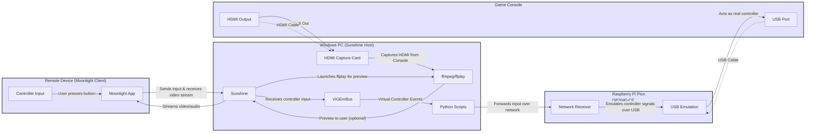

**Big Diagram: Console-Stream Architecture**

- **Blue boxes** = Hardware/Software units
- **Solid arrows** = Data flow
- **Dashed arrows** = Physical connections (cables)

### Summary:
- Your controller input and display are on the remote device (Moonlight).
- Video is streamed from the console to PC (via HDMI capture card), then to Moonlight.
- Controller input from Moonlight is sent back to the PC, then via Python scripts over the network to the Pico.
- The Pico emulates a real controller, sending input to the console via USB.
